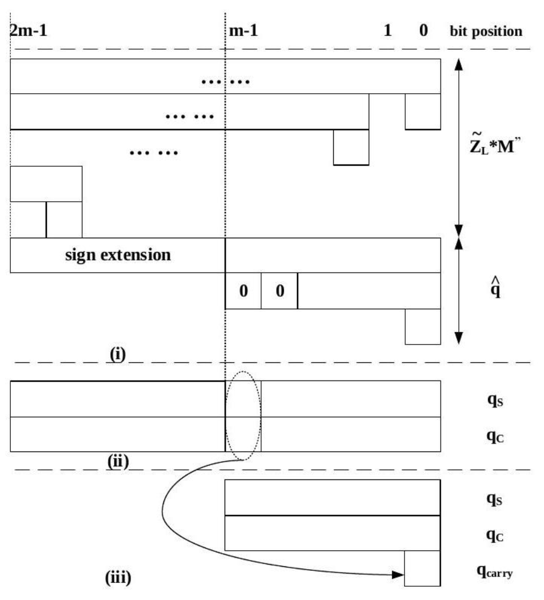
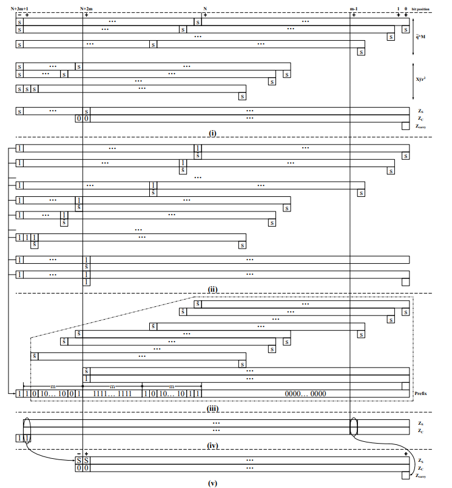

# Montgomery Modular Multiplication  [WIP]

> 该页面主要用于测试数学公式，以及 latex 风格伪代码的显示效果。

- 模乘： $\hat{Z} = \hat{X}\hat{Y}\mod M$， $M$ 是 $N$-bit 的正奇数 （$N = 1024, 2048, 3072$...）。

## 蒙哥马利域 Montgomery Domain

取 $R$ 为 2 的幂次，且 $R > M$. 我们可以将 $\hat{X}$ 转移到蒙哥马利域: $$X = \hat{X}R \mod M, \hat{X} = XR^{-1} \mod M $$

所以有:
$$ Z = \hat{Z}R \mod M = \hat{X}\hat{Y}R \mod M $$
$$ = \hat{X}RR^{-1}\hat{Y}RR^{-1}R \mod M $$
$$ = XYR^{-1} \mod M $$

蒙哥马利模乘的结果就是 $XYR^{-1} \mod M$，我们可以使用蒙哥马利约简（Montgomery Reduction），以乘法和移位替换掉模运算，但是直接约简仍需要大整数乘法。

## Basic Algorithm

$rr^{-1} \mod M = 1$

左边 $=Z^{(i)}r^{\lceil N/m \rceil} = Z^{(i)}R$

$$ZR < M^2 + MR$$
$$Z < 2M$$

$$Z \equiv_M XYR^{-1}$$
$$Z^{(i)} + q^{(i)}M \mod r = 0$$

$$Z^{(i)} + q^{(i)}M \mod r = Z^{(i)} + Z^{(i)}M'M \mod r$$
$$= Z^{(i)}(1+MM') \mod r$$
$$= Z^{(i)}rr^{-1} \mod r = 0$$

$$Z^{(i)}R = XY + MQ$$

$$RR^{-1} - MM'=1$$

$$i = d - 1 = \lceil N/m \rceil + 1$$

$$Z^{(i)}R =X \sum_{k=0}^{i} Y_{k} r^{k}+M \sum_{k=0}^{i-2} q^{(k+1)} r^{k}$$

$$Z^{(i)}R =XY+M \sum_{k=0}^{i-2} q^{(k+1)} r^{k}$$
$$Z^{(i)}R \le XY+M (r-1)\sum_{k=0}^{i-2}r^{k}$$
$$Z^{(i)} <(1+\frac{M}{R})M < 2M $$

$$Z^{(i-1)} + g^{(i)}M \equiv_{r^2} 0$$

基-m的蒙哥马利乘法：

::: pseudocode
% This quicksort algorithm is extracted from Chapter 7, Introduction to Algorithms (3rd edition)
\begin{algorithm}
\caption{Radix-$2^m$ Montgomery modular multiplication}
\begin{algorithmic}
\INPUT $X, Y \in [0, M)$, odd $M < 2^N, r = 2^m, d = \lceil N/m \rceil, R = r^{\lceil N/m \rceil}, rr^{-1} - MM' = 1$
\OUTPUT $Z \in [0, M)$
\STATE $Z^{(-1)} = 0$
\FOR{$i = 0$ \TO $d - 1$}
    \STATE $Z^{(i)} = Z^{(i-1)} + XY_i$
    \STATE $q^{(i)} = (Z^{(i)} \mod r)M' \mod r$
    \STATE $Z^{(i)} = (Z^{(i)} + q^{(i)}M)/r$
\ENDFOR
\STATE $Z = Z^{(d-1)}$
\IF{$Z \geq M$}
    \STATE $Z = Z - M$
\ENDIF
\RETURN $Z$
\end{algorithmic}
\end{algorithm}
:::

证明：--->

算法中第三到第五行不能并行， 都依赖于前一行的计算结果。

关键路径包括 **2次加法** 和 **3 次乘法**.

## Basic Optimized Algorithm

To reduce the length of critical path, we can parallelize the calculation of $q^{(i)}$ and $Z^{(i)}$.

::: pseudocode
\begin{algorithm}
\caption{Inventive radix-$2^m$ Montgomery modular multiplication: basic version}
\begin{algorithmic}
\INPUT $X, Y \in [0, M)$, odd $M < 2^N, r = 2^m, d = \lceil N/m \rceil + 2, R = r^{\lceil N/m \rceil}, r^2r^{-1} - MM'' = 1$
\OUTPUT $Z \in [0, M)$
\STATE $Z^{(-1)} = 0, q^{(-1)}=0$
\FOR{$i = 0$ \TO $d - 1$}
    \STATE $g^{(i)} = (Z^{(i-1)} \mod r^2) M'' \mod r^2$
    \STATE $q^{(i)} = (g^{(i)} - q^{(i-1)})/r$
    \STATE $Z^{(i)} = (Z^{(i-1)} + XY_ir^2 + q^{(i-1)}M)/r$
\ENDFOR
\STATE $Z = Z^{(d-1)}$
\IF{$Z \geq M$}
    \STATE $Z = Z - M$
\ENDIF
\RETURN $Z$
\end{algorithmic}
\end{algorithm}
:::

$q$ and $Z$ are independent of each other and thus can be computed in parallel.

The three multiplications in Algorithm 2 can be done in parallel. So the critical path contains only **1 multiplications** and **2 additions**. (Multiplying by $r^2$ can be replaced by shifting.)

It can be approved that $Z^{(d-1)} \in [0, 2M)$, when $d = \lceil N/m \rceil + 2$. 

## Advanced Optimized Algorithm

This algorithm replaces all multiplications and additions in each iteration with compression and encoding operations.

::: pseudocode
\begin{algorithm}
\caption{Inventive radix-$2^m$ Montgomery modular multiplication: advanced version}
\begin{algorithmic}
\INPUT $X, Y \in [0, M)$, odd $M < 2^N, r = 2^m, d = \lceil N/m \rceil + 2, R = r^{\lceil N/m \rceil}, r^2r^{-1} - MM'' = 1$
\OUTPUT $Z \in [0, M)$
\STATE $Z^{(-1)}_S = Z^{(-1)}_C = Z^{(-1)}_{carry} = q^{(-1)}_S = q^{(-1)}_C = q^{(-1)}_{carry} = 0$
\FOR{$i = 0$ \TO $d - 1$}
    \STATE \COMMENT{Form $Z^{(i-1)}, Z^{(i-1)}_L$, and $q^{(i-1)}$ as triplets}
    \STATE $Z^{(i-1)} = (Z^{(i-1)}_S, Z^{(i-1)}_C, Z^{(i-1)}_{carry}$
    \STATE $Z^{(i-1)}_L = (Z^{(i-1)}_S[2m-1:0], Z^{(i-1)}_C[2m-1:0], Z^{(i-1)}_{carry})$
    \STATE $q^{(i-1)} = (q^{(i-1)}_S, q^{(i-1)}_C, q^{(i-1)}_{carry})$
    \STATE \COMMENT{Encode $Z^{(i-1)}_L$ and $q^{(i-1)}$}
    \STATE $\tilde{Z}^{(i-1)}_L =$ Encode$(Z^{(i-1)}_L)$
    \STATE $\tilde{q}^{(i-1)} =$ Encode$(q^{(i-1)})$
    \STATE $\hat{q}^{(i-1)} =$ EncodeSN$(q^{(i-1)})$
    \STATE \COMMENT{Compress for $\tilde{Z}^{(i-1)}_LM'' - \hat{q}^{(i-1)}$}
    \STATE $(q^{(i)}_S, q^{(i)}_C) =$ Compress1$(\tilde{Z}^{(i-1)}_LM'' - \hat{q}^{(i-1)})$
    \STATE \COMMENT{Perform division over $r$ by right shifting}
    \STATE $q^{(i)}_{carry} = q^{(i)}_S[m-1]$ OR $q^{(i)}_C[m-1]$
    \STATE $q^{(i)}_S = q^{(i)}_S >> m, q^{(i)}_C = q^{(i)}_C >> m$
    \STATE \COMMENT{Compress for $Z^{(i-1)} + X\tilde{Y}_ir^2 + \tilde{q}^{(i-1)}M$}
    \STATE $\tilde{Y}_i = Y_i - Y_i[m-1]r + Y_{i-1}[m-1]$
    \STATE $(Z^{(i)}_S, Z^{(i)}_C) =$ Compress2$(Z^{(i-1)} + X\tilde{Y}_ir^2 + \tilde{q}^{(i-1)}M)$
    \STATE \COMMENT{Prevent overflow from signed compression}
    \STATE $Z^{(i)}_S[N+3m] = Z^{(i)}_S[N+3m]$ XNOR $Z^{(i)}_C[N+3m]$
    \STATE $Z^{(i)}_C[N+3m] = 0$
    \STATE \COMMENT{Perform division over $r$ by right shifting}
    \STATE $Z^{(i)}_{carry} = Z^{(i)}_S[m-1]$ OR $Z^{(i)}_C[m-1]$
    \STATE $Z^{(i)}_S = Z^{(i)}_S >> m, Z^{(i)}_C = Z^{(i)}_C >> m$
\ENDFOR
\STATE $Z = Z^{(d-1)}_S + Z^{(d-1)}_C + Z^{(d-1)}_{carry}$
\IF{$Z \geq M$}
    \STATE $Z = Z - M$
\ELSEIF{$Z < 0$}
    \STATE $Z = Z + M$
\ENDIF
\RETURN $Z$
\end{algorithmic}
\end{algorithm}
:::

### Compress1

$\tilde{Z}_L*M''$ has $m$ partial products, and each partial products has a tail bit. Why there exists a tail bit? Because when encoded group of  $\tilde{Z}_L$ is negative, the $M''$ need to be complemented. To remove the add operation, we split the `+1` operation from the complement procedure. 

### Compress2

