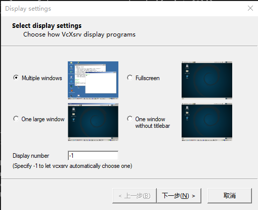
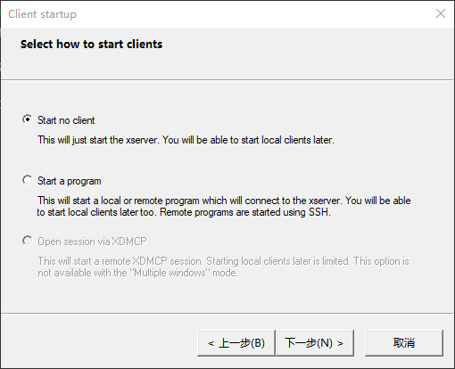
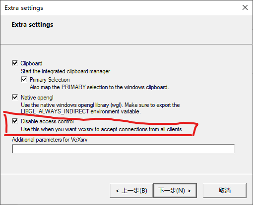
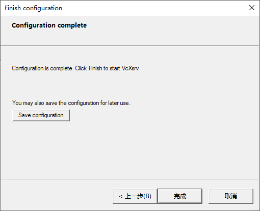
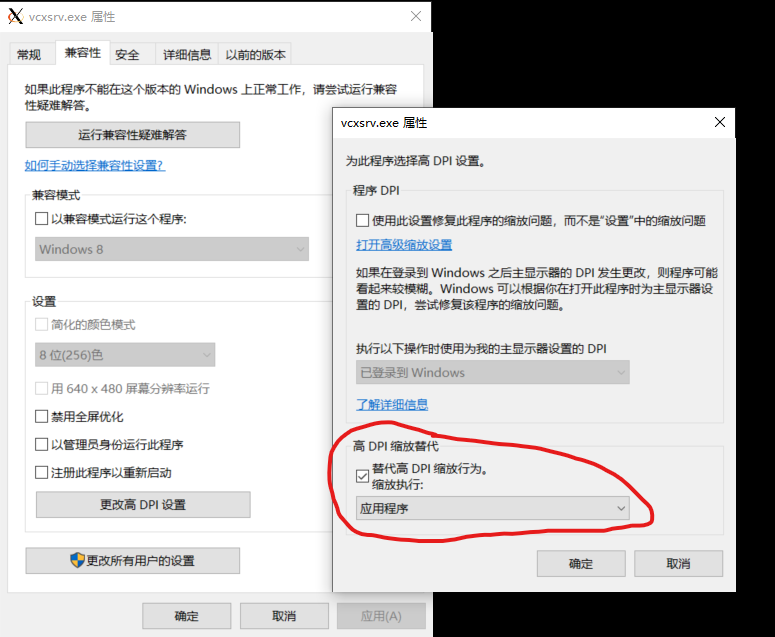

# 在WSL2中启用GUI

## 参考

[WSL github issue #4106](https://github.com/microsoft/WSL/issues/4106)

## 准备
> 本篇文章只适用于WSL2。WSL1的解决方案比较简单，网上的教程也很多，所以不再多讲。

首先在cmd或powershell中确认WSL的版本号为2

```powershell
PS C:\> wsl -l --all -v
  NAME            STATE           VERSION
* Ubuntu-18.04    Running         2
```

## 确定主机IP

把下面一行写入`~/.bashrc`或者`~/.zshrc`(根据你的shell而定)

```shell
export DISPLAY=`cat /etc/resolv.conf | grep nameserver | awk '{print $2}'`:0.0
```

## 安装VcXsrv

可以从sourceforge上下载安装包：[https://sourceforge.net/projects/vcxsrv/](https://sourceforge.net/projects/vcxsrv/)，一般来说默认安装即可。

## 启动

安装完成后点击Xlaunch启动，如图所示 


4个模式的效果很容易看出来，看不出来也可以自己一个个试，选择自己习惯的就行。点击下一步


直接点击下一步


注意这里要勾选`Disable access control`，然后点击下一步


这里的保存配置会生成一个文件并让你选择保存的位置，推荐保存，下一次启动的时候就可以直接启动这个配置文件（也可以在命令行里打开）。点击完成之后，在右下角托盘区就会有VcXsrv的图标，表示已经启动。

## 防火墙配置

实际上这样子还不能启动gui，试图启动的时候会被Windows的防火墙阻止。可以直接关掉防火墙，或者用在管理员模式的powershell里输入下面的命令：
```powershell
Set-NetFirewallProfile -Name public -DisabledInterfaceAliases "vEthernet (WSL)" 
```
这个命令指挥关掉WSL的虚拟局域网的防火墙。

## 保存为脚本

为方便使用，可以把这行命令保存成脚本，后缀为.ps1，例如`G:\\Scripts\\disableWSLFirewall.ps1`，但是powershell的管理员权限脚本会限制直接运行，可以再套一个cmd脚本，内容是提升权限运行powershell脚本
```shell
Powershell.exe -executionpolicy remotesigned -File G:\Scripts\disableWSLFirewall.ps1
```
里面的路径需要换成你的ps1脚本路径。另外，如果你也保存了VcXsrv的脚本的话，也可以直接在这个cmd脚本中添加VcXsrv脚本的路径。
所以我的cmd脚本`wslGui.bat`内容如下
```shell
Powershell.exe -executionpolicy remotesigned -File G:\Scripts\disableWSLFirewall.ps1
G:\Scripts\multiWindow.xlaunch
```

::: warning
这个脚本的运行需要以管理员模式，并且需要在启动过一次WSL之后才会有效（Windows重启以后，WSL启动之前，是不存在WSL的虚拟局域网的，所以这时候脚本会报错）。
:::

## HiDPI的设置

在高分屏下(Win10 显示设置中的缩放比率大于100%），VcXsrv的显示会模糊，这不只是WSL的原因，我目前的解决办法是让VcXsrv使用100%的缩放。
- 首先找到VcXsrv.exe的位置，右键开始菜单中的Xlaunch图标，`更多`->`打开文件位置`，找到Xlaunch的快捷方式的位置
- 然后右键这个快捷方式，点击`打开文件所在的位置`
- 在打开的目录里找到`vcxsrv.exe`这个文件，右键->`属性`
- 选择`兼容性`选项卡，点击`更改高DPI设置`
- 在弹出的窗口中修改下面的选项
- 确定，搞定

15.7寸笔记本100%分辨率对于对我来说还能勉强看，至于选择清晰的字体还是大的字体，这取决于你自己了。

## 由于代理出现的异常

说个和GUI无关的事。有时候会因为代理的原因导致WSL无法启动，出现`参考的对象类型不支持尝试的操作。`，这时候用管理员模式运行`netsh winsock reset`即可（会提示重启，但是实际上不需要重启），参考 [WSL github issue #4194](https://github.com/microsoft/WSL/issues/4194)

